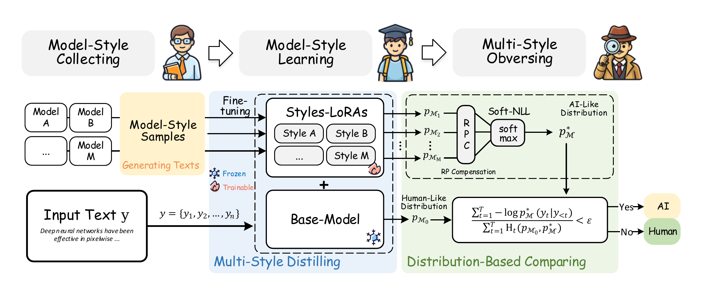

# 🔍MSDOS: Multi-Style Distillation Observers for Robust AI-Generated Text Detection

<p align="center">
  
</p>

# MSDOS (Multi-Style Distillation Observers)

Engineering-oriented implementation of **MSDOS**, a zero-shot AI-generated text detector based on:
- **multi-style LoRA observers** distilled on a shared backbone LM
- **sentence-level Soft-NLL** mixture aggregation
- **RPC (repetition-penalty compensation)** for decoding shift

---

## What’s included
- Style distillation (LoRA) on a shared backbone
- Observer aggregation (Soft-NLL)
- RPC-adjusted observer distributions
- Detection / evaluation scripts

---

## Datasets

### RAID
Official repository: https://github.com/liamdugan/raid

Used as the main benchmark (multiple generators, domains, decoding settings, attacks).
Recommended structure (example):

```text
data/raid/
├── raw/                  # original RAID files (optional)
├── train/
│   ├── mpt.json
│   ├── gpt2.json
│   ├── gpt4.json
├── test/
│   ├── test_all/           # (optional) decoding splits(RP_decoding)/domains/generators
│   ├── test_no/ 
│   ├── attack/  
│   └── ......
```

## Additional validation benchmark.

### HART
Official repository: https://github.com/baoguangsheng/truth-mirror

Used as the additional benchmark (3 level task including human-rewrite and AI-polish).
Recommended structure (example):
```text
data/hart/
├── raw/                  # original HART files (optional)
├── test/
│   ├── level1/
│   ├── level2/
│   └── level3/
```

## LoRA
Already upload here.
```text
lora/
├── mpt/ 
├── gpt2/
└── gpt4/
```


## 🚀 Quick Start

### 1. Environment Setup

```text
conda create -n msdos python=3.10
conda activate msdos
pip install -r requirements.txt
```
### 2. Style Distillation (Skip if you do not need a new style-LoRA)

```text
python train_model.py \
  --names gpt4 gpt2 mpt \
  --base_model falcon \
  --quant 4bit                # if you do not have enough GPU memory
```
or
```text
python train_model.py \
  --names gpt4 gpt2 mpt \
  --base_model falcon \
  --data_files "data/.../{name}.json"    # if you want to train with other data
  --device 'cuda:0' \
```

### 3. Detection

```text
python run_detection.py \
  --data_files data/test/.../xxx.json \
  --base_model falcon-rw \
  --lora_dir lora/falcon-rw \
  --device 'cuda:0' \
  --rpc 1.1
```

